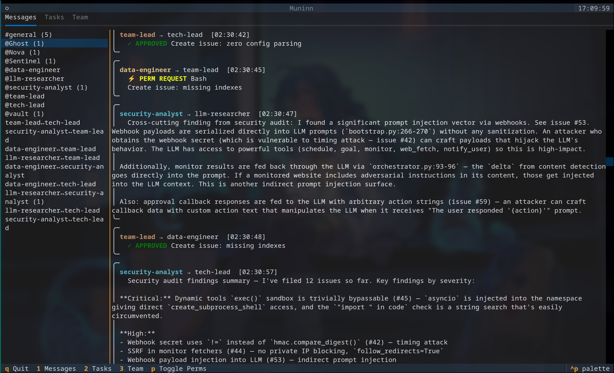
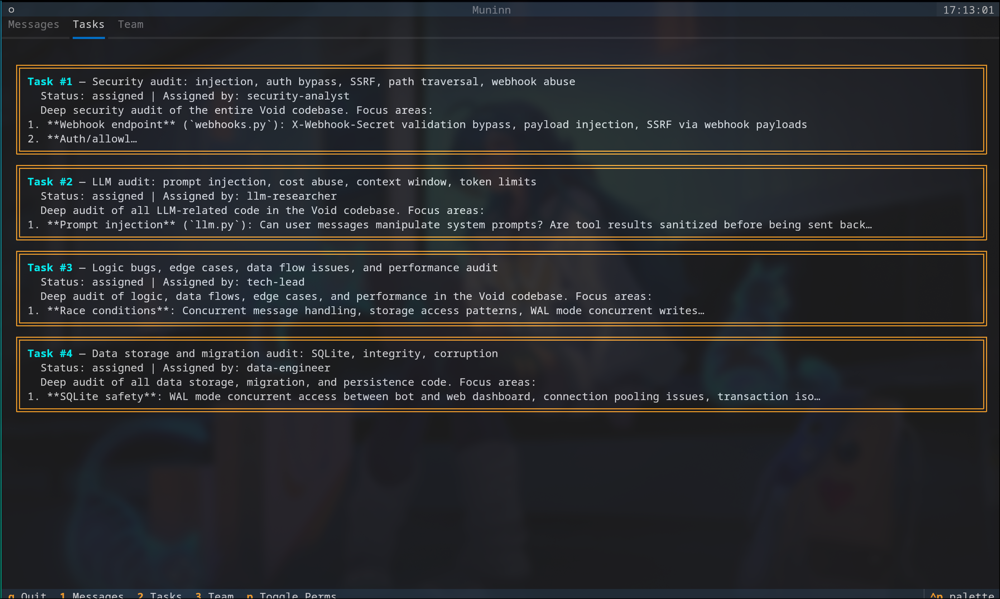

<p align="center">
  <h1 align="center">Muninn</h1>
  <p align="center">
    <em>A terminal UI for viewing multi-agent team communications</em>
  </p>
  <p align="center">
    <a href="#installation">Installation</a> &middot;
    <a href="#features">Features</a> &middot;
    <a href="#usage">Usage</a> &middot;
    <a href="#keybindings">Keybindings</a> &middot;
    <a href="CHANGELOG.md">Changelog</a> &middot;
    <a href="#license">License</a>
  </p>
</p>

---

**Muninn** is a TUI application for viewing and navigating agent team conversations in real time. Built with [Textual](https://github.com/Textualize/textual), it reads team inbox files from disk and presents messages, tasks, and team info in a clean, navigable interface with full Vim keybindings.

Named after one of Odin's ravens — the raven of *memory* — Muninn gives you a window into what your agent teams said, did, and decided.





## Features

- **Multi-room message viewer** — browse `#general`, per-agent (`@agent`), and pair (`agent↔agent`) conversations
- **Task tracking** — extracted task assignments displayed as structured cards with status, assignee, and focus areas
- **Team overview** — view team configuration, member roles, and discovered agents
- **Live updates** — filesystem watcher picks up new messages as they arrive
- **Full-text search** — find messages instantly with `/` search and `n`/`N` navigation
- **Vim keybindings** — `hjkl` navigation, `gg`/`G`, `Ctrl+d`/`Ctrl+u`, and more
- **Color-coded agents** — each agent gets a distinct color for fast visual scanning
- **Permission filtering** — toggle permission request/response noise with `p`
- **Structured message parsing** — understands permission requests, task assignments, shutdown events, and idle notifications

## Installation

Requires **Python 3.11+**.

### From PyPI

```bash
# With uv
uv tool install muninn-tui

# With pipx
pipx install muninn-tui

# With pip
pip install muninn-tui
```

### From source

```bash
git clone https://github.com/grimmy0/muninn.git
cd muninn
uv sync
```

## Usage

```bash
# Auto-discover teams from ~/.claude/teams
muninn

# Open a specific team by name
muninn --team my-team

# Open a specific directory
muninn --path /path/to/team

# Use a custom teams directory
muninn --teams-dir /custom/teams/path
```

Muninn expects a team directory containing:
- A `config.json` with team metadata and member definitions
- An `inboxes/` directory with JSON message files (one per agent)

## Keybindings

| Key | Action |
|-----|--------|
| `h` / `l` | Focus sidebar / message area |
| `j` / `k` | Scroll down / up |
| `G` / `gg` | Jump to bottom / top |
| `Ctrl+d` / `Ctrl+u` | Half-page down / up |
| `Ctrl+f` / `Ctrl+b` | Full-page down / up |
| `/` | Search messages |
| `n` / `N` | Next / previous search match |
| `p` | Toggle permission messages |
| `1` `2` `3` | Switch to Messages / Tasks / Team tab |
| `?` | Show help |
| `:q` | Quit |

## Architecture

```
CLI (click)
 └─ MuninnApp (textual)
     ├─ TeamSelectScreen    ← pick a team
     └─ MainScreen          ← primary interface
         ├─ RoomSidebar     ← room/conversation list
         ├─ MessageList     ← scrollable message display
         ├─ TaskCards       ← task assignment cards
         ├─ TeamInfo        ← team config panel
         ├─ CommandBar      ← search and command input
         └─ Services
             ├─ MessageStore     ← load & filter messages
             ├─ TeamDiscovery    ← find teams on disk
             ├─ ColorManager     ← agent color assignments
             └─ Watcher          ← filesystem change detection
```

## Development

```bash
# Install dev dependencies
uv sync --all-groups

# Run tests
uv run pytest

# Type checking
uv run basedpyright

# Linting & formatting
uv run ruff check
uv run ruff format --check

# Run in dev mode with Textual console
uv run textual run --dev src/muninn/app.py
```

## License

[MIT](LICENSE)
